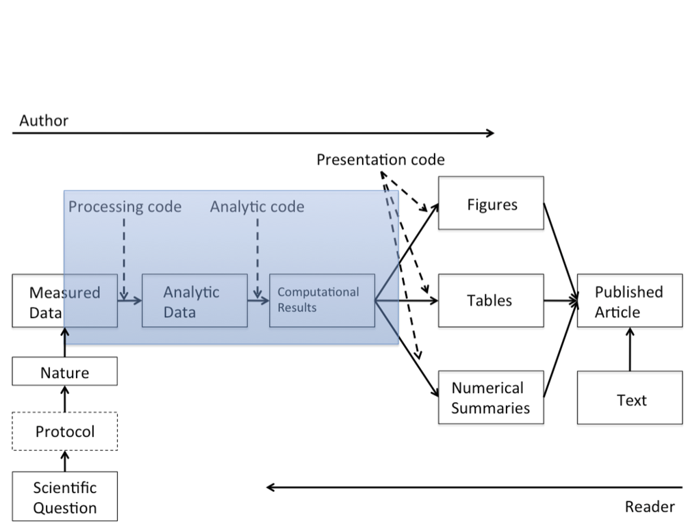

```{css, echo = F}
h1, h2, h3 {

  font-weight: bold;

}
```


```{r echo= FALSE, include=FALSE}
knitr::opts_chunk$set(echo = TRUE, warning = F, message = F, tidy = T)
```

```{r echo= FALSE}
library(tidyverse)

magick_webshot <- function(...){
  webshot::webshot(...)
  webshot <- magick::image_read("webshot.png")
  file.remove("webshot.png")
  webshot
}
```

<br>

---

### **Handout at:**
[**http://annakrystalli.me/literate-programming/**]( http://annakrystalli.me/literate-programming/)

### **Materials on [GitHub](https://github.com/annakrystalli/literate-programming/tree/master)**

#### [\@annakrystalli](https://twitter.com/annakrystalli) | a.krystalli\[at]sheffield.ac.uk


<br>
<br>

---

# Literate programming


Programming paradigm first introduced by **Donald E. Knuth**. 

> Treat program as a literature understandable to human beings

- move away from writing programs in the manner and order imposed by the computer

- focus instead on the logic and flow of human thought and understanding

- single document to integrate data analysis (executable code) with textual documentation, **linking data, code, and text**


<br>


---

## Why is this important in science:

### Computational science has led to exciting new developments

- Increasing data collection throughput; data are more complex and highdimensional

- Existing databases can be merged to become bigger databases

- Computing power allows more sophisticated analyses, even on "small" data

- For every field "X" there is a "Computational X"

---

### Increased computational complexity has exposed limitations in our ability to evaluate published findings

- Even basic analyses difficult to describe

- Errors more easily introduced into long analysis pipelines

- Knowledge transfer is inhibited

- Results are difficult to replicate or reproduce

- Complicated analyses cannot be trusted

---

### **Calls for reproducibility**

<br>

>  Reproducibility has the potential to serve as a minimum standard for judging scientific claims when full independent replication of a study is not possible.

 

- **Fully scripted analyses workflows**
- **Publication of code and data available**



<br>


---

## **Calls for open science**


> ... highlight problems with users jumping straight into software implementations of methods (e.g. in r) that may lack documentation on biases and assumptions that are mentioned in the original papers.

> <small> To help solve these problems, we make a number of suggestions including **providing blog posts** or **videos** to explain new methods in less technical terms, **encouraging reproducibility and code sharing**, making **wiki-style pages** summarising the literature on popular methods, more careful consideration and testing of whether a method is appropriate for a given question/data set, increased collaboration, and a shift from publishing purely novel methods to publishing improvements to existing methods and ways of detecting biases or testing model fit. Many of these points are applicable across methods in ecology and evolution, not just phylogenetic comparative methods.</small>

<br>

---

### **Science and the web**

#### **the web was made for open science !**


###### [Executive summary of the first ever website](http://info.cern.ch/hypertext/WWW/Summary.html)

<br>

---

# **Literate programming in R**

**rmarkdown (`.Rmd`) integrates:**

–  a **documentantion** language (`.md`)


–  a **programming** language (`R`)


Combine **tools, processes** and **outputs** into interactive **evidence streams** that are easily shareable, particularly through the web.


<br>

---

## **Rmarkdown overview**

### Features

Rstudio features fly through

<iframe src="https://player.vimeo.com/video/178485416?color=428bca&title=0&byline=0&portrait=0" width="640" height="400" frameborder="0" webkitallowfullscreen mozallowfullscreen allowfullscreen></iframe>
<p><a href="https://vimeo.com/178485416">What is R Markdown?</a> from <a href="https://vimeo.com/rstudioinc">RStudio, Inc.</a> on <a href="https://vimeo.com">Vimeo</a>.</p>

<br>

---


### The researchers perspective

#### a reproducible workflow in action

<iframe width="560" height="315" src="https://www.youtube.com/embed/s3JldKoA0zw" frameborder="0" allowfullscreen></iframe>

<br>

---


## elements of R markdown

---

## **markdown `.md`**

#### stripped down **`html`**. User can focus on communicating & disseminating

<br>

-  intended to be as **easy-to-read** and **easy-to-write** as possible.
-  intended for one purpose: to be used as a **format for writing for the web.**
-  clean and legible across platforms and outputs
-  **syntax is very small**, corresponding only to a very small subset of HTML tags. 
-  formatting handled automatically
- html markup also handled.

---

## **code {r,** python, SQL, ... **}**

- Code chunks defined through special notation. Executed in sequence. Exceution of individual chunks controllable

- Analysis self-contained and reproducible
    - Run in a fresh R session every time document is knit.
    
- A number of [Language Engines](https://rmarkdown.rstudio.com/authoring_knitr_engines.html) are supported by `knitr`
    - **R** (default)
    - Python
    - SQL
    - Bash
    - Rcpp
    - Stan
    - JavaScript
    - CSS
    
- Can read appropriately annotated `.R` scripts in and call them within an `.Rmd`

---

## **outputs**

**Knit together through package `knitr` to **


Many great packages and applications build on rmarkdown.

All this makes it incredibly versatile. Check out the [gallery](https://rmarkdown.rstudio.com/gallery.html)

<br>

**Simple interface to powerful modern web technologies and libraries**

```{r echo=F}

magick::image_read("http://www.kagesoft.com/images/web-technologies.png") %>%
  magick::image_resize("400x400") 

```

## Applications in research

### `Rmd` documents

Can be useful for a number of research related materials

- [**Vignettes**](http://r-pkgs.had.co.nz/vignettes.html): long form documentation.
    - Analyses
    - Documentation (code & data)
    - Supplementary materials
- Reports
- Papers

Useful features:
- [bibliographies and citations](https://rmarkdown.rstudio.com/authoring_bibliographies_and_citations.html)


### [`bookdown`](https://bookdown.org/yihui/bookdown/)

Authoring with R Markdown. Offers:

- cross-references, 
- citations, 
- HTML widgets and Shiny apps,
- tables of content and section numbering

The publication can be exported to HTML, PDF, and e-books (e.g. EPUB)
Can even be used to write thesis!


---

### [pkgdown](http://pkgdown.r-lib.org/articles/pkgdown.html)

#### For buidling package documentation

- Can use it to document any functional code you produce and demonstrate it's us ethrough vignettes 


```{r echo=F}
cliprect <- c(5, 5, 600, 400)
expand <- c(92, 400, 500, 10)
magick_webshot(url = "https://ropenscilabs.github.io/pkgreviewr/",
               cliprect = cliprect,
               expand = expand) %>% magick::image_resize("600x800")
```


---

### [workflowr](https://jdblischak.github.io/workflowr/) pkg

#### Build analyses websites and organise your project

The workflowr R package makes it easier for researchers to organize their projects and share their results with colleagues.

```{r echo=F}
cliprect <- c(5, 5, 600, 800)
expand <- c(92, 400, 500, 10)
c(magick_webshot(url = "http://annakrystalli.me/news-scrape/",
               cliprect = cliprect,
               expand = expand),
  magick_webshot(url = "http://annakrystalli.me/news-scrape/compile_db.html",
               cliprect = c(5, 100, 600, 800),
               expand = expand)) %>% magick::image_append() %>% magick::image_resize("600x800")

```

---

### blogdown

#### For creating and mantaining blogs.

Check out <https://awesome-blogdown.com/>, **a curated list of awesome #rstats blogs in blogdown** for inspiration!


```{r echo=F}
magick_webshot(url = "https://awesome-blogdown.com/",
               cliprect = c(5, 5, 450, 200),
               expand = c(92, 800, 500, 10))
```

---


## Let's have a look

### open your first `.Rmd`!!

<div class="alert alert-info"><strong>File > New File > RMarkdown... > Document</strong></div>


---

### save and render it

Render an `.Rmd` document by clicking on the **knit** button.

```{r echo=F}
magick::image_read("assets/knit.png") %>% magick::image_resize("300x400")
```

You can also render `.Rmd` documents to html using `rmarkdown` function `render()`

```{r, eval = F}
rmarkdown::render(input = "render-this-doc.Rmd")
```

---

### open the cheatsheet


[](https://www.rstudio.com/wp-content/uploads/2015/02/rmarkdown-cheatsheet.pdf)

### install the packages we'll need

```{r, eval=FALSE}
install.packages(c("rmarkdown", "tidyverse", "plotly", "DT", "reprex"))
```


---


<br>
<br>

# **YAML header**

## define outputs


---

### basic **`html_document`**

```
output: html_document
```
```{r, echo=FALSE}
magick_webshot(url = "http://rpubs.com/annakrystalli/output",
               cliprect = c(5, 5, 400, 200),
               expand = c(92, 800, 500, 10))
```

---

## define a floating table of contents

```
output: 
  html_document:
    toc: true
    toc_float: true
```

```{r, echo=FALSE}
magick_webshot(url = "http://rpubs.com/annakrystalli/toc",
               cliprect = c(5, 5, 400, 200),
               expand = c(92, 800, 500, 10))
```


---

## choose a theme


Specify [bootswatch themes](http://bootswatch.com/). 

```
output: 
  html_document:
    toc: true
    toc_float: true
    theme: cosmo
```


```{r, echo=FALSE}
magick_webshot(url = "http://rpubs.com/annakrystalli/theme",
               cliprect = c(5, 5, 400, 200),
               expand = c(92, 800, 500, 10))
```


---

Can also override with custom .css

```
output: 
  html_document:
    toc: true
    toc_float: true
    theme: cosmo
    css: assets/css/my-theme.css
```

---

## choose code highlights

```
output: 
  html_document:
    toc: true
    toc_float: true
    theme: cosmo
    highlights: zenburn
```

```{r, echo=FALSE}
magick_webshot(url = "http://rpubs.com/annakrystalli/372827",
               cliprect = c(5, 5, 400, 200),
               expand = c(92, 800, 500, 10))
```


---


<br>


# **Markdown basics**

<br>

---

## **text**

        normal text
normal text

        *italic text*
*italic text*

        **bold text**
**bold text**

        ***bold italic text***
***bold italic text***

---
        superscript^2^

superscript^2^

        ~~strikethrough~~
~~strikethrough~~ 

<br>

---

## **headers**

**rmarkdown**

```
# Header 1
## Header 2
### Header 3
#### Header 4
##### Header 5
###### Header 6
```
**rendered html**


```{r, echo=FALSE}
magick::image_read("assets/headers.png") %>% magick::image_resize("700x800")

```

---

## **unordered lists**


**rmarkdown**
```
- first item in the list
- second item in list
- third item in list
```

**rendered html**

- first item in the list
- second item in list
- third item in list

---

## **ordered lists**

**rmarkdown**
```
1. first item in the list
1. second item in list
1. third item in list
```
**rendered html**

1. first item in the list
1. second item in list
1. third item in list

---

## **quotes**

**rmarkdown**

    > this text will be quoted
   
**rendered html** 

 > **this text will be quoted**
 
---

## **code**
### annotate code inline

**rmarkdown**

    `this text will appear as code` inline

**rendered html**

`this text will appear as code` inline

<br>

---

### evaluate r code inline

```{r}
a <- 10
```


```{r, echo = F}
a <- "`r a`"
```

**rmarkdown**

```
the value of parameter *a* is `r a`

```
```{r, echo = F}
a <- 10
```

**rendered html**

the value of parameter *a* is `r a`

<br>

---

## **images**

**rmarkdown**

``` 


```

**rendered html** 


---

### **resize images**

**html in rmarkdown**

```

```

**rendered html** 


---

## **basic tables in markdown**

**rmarkdown**

```

    Table Header  | Second Header
    ------------- | -------------
    Cell 1        | Cell 2
    Cell 3        | Cell 4 
```

**rendered html** 

Table Header  | Second Header
------------- | -------------
Cell 1        | Cell 2
Cell 3        | Cell 4 

Check out handy [**online .md table converter**](http://www.tablesgenerator.com/markdown_tables)

<br>

---

## **links**

**rmarkdown**

    [Download R](http://www.r-project.org/)    
    [RStudio](http://www.rstudio.com/)
    
**rendered html** 

[Download R](http://www.r-project.org/)    

[RStudio](http://www.rstudio.com/)

<br>

---

## html in rmarkdown

### marking up with html tags

**This text marked up in html**

```
<strong>Bold text</strong>

```

**renders to this**

<strong>Bold text</strong>

<br>

**This text marked up with [**Bootstrap alert css classes**](https://www.w3schools.com/bootstrap/bootstrap_alerts.asp)

```
<div class="alert alert-warning"><small>this a is warning message</small></div>

```

**renders to**

<div class="alert alert-warning"><small>this a is warning message</small></div>


<br>

```
<div class="alert alert-success"><small>this a is success message</small></div>

```

**renders to**

<div class="alert alert-success"><small>this a is success message</small></div>

---

### embedding tweets

**This snipped copied from twitter in the embed format**

```
<blockquote class="twitter-tweet" data-lang="en"><p lang="en" dir="ltr">How cool does this tweet look embedded in <a href="https://twitter.com/hashtag/rmarkdown?src=hash&amp;ref_src=twsrc%5Etfw">#rmarkdown</a>! 😎</p>&mdash; annakrystalli (@annakrystalli) <a href="https://twitter.com/annakrystalli/status/977209749958791168?ref_src=twsrc%5Etfw">March 23, 2018</a></blockquote>
<script async src="https://platform.twitter.com/widgets.js" charset="utf-8"></script>

```

**renders to this**

<blockquote class="twitter-tweet" data-lang="en"><p lang="en" dir="ltr">How cool does this tweet look embedded in <a href="https://twitter.com/hashtag/rmarkdown?src=hash&amp;ref_src=twsrc%5Etfw">#rmarkdown</a>! 😎</p>&mdash; annakrystalli (@annakrystalli) <a href="https://twitter.com/annakrystalli/status/977209749958791168?ref_src=twsrc%5Etfw">March 23, 2018</a></blockquote>
<script async src="https://platform.twitter.com/widgets.js" charset="utf-8"></script>

Embbed gifs, videos, widgets in this way

---

## Mathematical Expressions

Supports mathematical notations through [MathJax](http://www.onemathematicalcat.org/MathJaxDocumentation/TeXSyntax.htm).

You can write LaTeX math expressions inside a pair of dollar signs, e.g. `$\alpha+\beta$` renders $\alpha+\beta$. You can use the display style with double dollar signs:

```
$$\bar{X}=\frac{1}{n}\sum_{i=1}^nX_i$$
```

$$\bar{X}=\frac{1}{n}\sum_{i=1}^nX_i$$

---


# Chunks

---

**R code chunks execute code.**

They can also be used as a means render R output into documents or to simply display code for illustration (eg with option `eval=FALSE`)


---

## **chunk notation**

**chunk notation in `.rmd`**

    `r ''````{r chunk-name}
    print('hello world!')
    ```
**rendered html code and output**

```{r chunk-name}
print('hello world!')
```

Chunks can be labelled with chunk names, names must be unique.

---

## **chunk options**


for more details see <http://yihui.name/knitr/>

---

## uses

- controlling whether code is displayed inline (`echo` setting)
- controlling whether code is evaluated (`eval` setting)
- controlling how figures are displayed (`fig.width` and  `fig.height` settings)
- suppressing warnings and messages  (`warning` and  `message` settings)
- cacheing computations  (`cache` setting)
- controlling whether code is extracted when using purl (`purl` settings)

---

### controlling code display with `echo`

**chunk notation in `.rmd`**

    `r ''````{r hide-code, echo=FALSE}
    print('hello world!')
    ```
**rendered html code and output**

```{r hide-code, echo=FALSE}
print('hello world!')
```

---

### controlling code evaluation with `eval`

**chunk notation in `.rmd`**

    `r ''````{r dont-eval, eval=FALSE}
    print('hello world!')
    ```
**rendered html code and output**

```{r dont-eval, eval=FALSE}
print('hello world!')
```

---

### **setting document level default options**

```{r, eval=F}
knitr::opts_chunk$set(echo = TRUE, warning = F, message = F)
```

---

## **reading chunks of code** (`R` -> `Rmd`)

You can read in chunks of code from an annotated `.R` (or any other language) script using `knitr::read_chunks()`

Chunks are defined by the following notation

```
# ---- descriptive-chunk-name1 ----
code("you want to run as a chunk")

# ---- descriptive-chunk-name1 ----
code("you want to run as a chunk")
```

---

### code in `.R` script **`hello-world.R`**


**`hello-world.R`**

```{r echo=FALSE, message=TRUE, comment=""}
message(readr::read_file("hello-world.R"))

```

<br>


### read chunks from `hello-world.R`


```{r}
knitr::read_chunk("hello-world.R")
```


```{r echo=FALSE}
demo_chunk <- knitr:::knit_code$get()

demo_chunk <- demo_chunk[names(demo_chunk) == "demo-read_chunk"]

```


<br>

---

### call chunk by name

**rmarkdown r chunk notation**

    `r ''````{r demo-read_chunk}
    
    ```

**rendered html code and output**

```{r demo-read_chunk}
    
```

<br>

---

### Check chunks in the current session

```{r, eval=FALSE}
knitr:::knit_code$get()  
```


```{r echo=F}
demo_chunk
```


---

## **Extracting code from an `.Rmd`** (`Rmd` -> `R`)

You can use `knitr::purl()` to *tangle* code out of an `Rmd` into an `.R` script. **`purl`** takes many of the same arguments as `knit()`. The most important additional argument is:

- **`documentation`:** an integer specifying the level of documentation to go the tangled script: 
    + **0** means pure code (discard all text chunks)
    + **1** (default) means add the chunk headers to code
    + **2** means add all text chunks to code as roxygen comments

```{r eval=F}
purl("file-to-extract-code-from.Rmd", documentation = 0)
```

---

### extract using `purl`

Here i'm running a loop to **extract the code in `demo-rmd.Rmd`** for each documentation level

```{r, results='hide'}

file <- "demo-rmd.Rmd"
for(docu in 0:2){
knitr::purl(file, output = paste0(gsub(".Rmd", "", file), "_", docu, ".R"),
            documentation = docu, quiet = T)
}

```

---

#### **`demo-rmd_0.R`**

```{r echo=FALSE, message=TRUE, comment=""}

message(readr::read_file("demo-rmd_0.R"))

```

---

#### **`demo-rmd_1.R`**

```{r echo=FALSE, message=TRUE, comment=""}

message(readr::read_file("demo-rmd_1.R"))

```

---

#### **`demo-rmd_2.R`**

```{r echo=FALSE, message=TRUE, comment=""}

message(readr::read_file("demo-rmd_2.R"))

```

---

## Displaying data

### printing `data.frame`s
```{r}
data(airquality)
head(airquality)
```

---

### printing `tibble`s
```{r}
library(tibble)
as_tibble(airquality)
```

---

### **`knitr::kable()` tables**

```{r, warning=FALSE, message=FALSE}
library(knitr)
data(airquality)
kable(head(airquality), caption = "New York Air Quality Measurements")
```

<br>

---

## plots


```{r}
set.seed(100)
d <- diamonds[sample(nrow(diamonds), 1000), ]

p <- ggplot(data = d, aes(x = carat, y = price)) +
  geom_point(aes(text = paste("Clarity:", clarity)), size = 1) +
  geom_smooth(aes(colour = cut, fill = cut)) + facet_wrap(~ cut)

```

---

```{r}
p
```


<br>

---


# **interactivity**

---

## **`DT::datatable()` tables**
```{r, warning=FALSE, message=FALSE}
library(DT)
data(airquality)
datatable(airquality, caption = "New York Air Quality Measurements")
```

<br>

---

## **[plotly](https://plot.ly/) plots**

Wraps nicely around plotting library **`ggplot2`**

```{r, warning=FALSE, message=FALSE}
library(plotly)

ggplotly(p)

```

<br>

---

## **shiny**

Shiny allows you to build interactive apps and dash boards through R and publish them through a free **shinyapps** account.


### <http://shiny.rstudio.com/>

<br>

---

## **rpubs**

### <http://rpubs.com/>


<br>

---


# **Exercise**

---

## **your mission**

> *create your first `.Rmd`!*

- choose some data eg: 
    + [`datasets`](https://stat.ethz.ch/R-manual/R-devel/library/datasets/html/00Index.html) package 
    + `data(package = .packages(all.available = TRUE))`
    + A dataset of your own
- show us some data in a table
- plot some data
- write a bit about what you did
- publish it on rpubs. Add you link to our [googledoc](https://docs.google.com/document/d/1-yDYTwBU-shqRvpG903K4iSsVyGZDXdfWakrAbf7KUE/edit?usp=sharing)


### See my example: **beavers!** 

- [html](http://rpubs.com/annakrystalli/200119) 
- [raw .Rmd](https://raw.githubusercontent.com/annakrystalli/ISBE_symposium/master/markdown/beavers.Rmd)

---


# Parting words

---

## Getting help with markdown

**To get help, you need a reproducible example**

- github issues
- stackoverflow
- slack channels
- discussion boards

---

### `reprex`

Use function **`reprex::reprex()`** to produce a reproducible example in a custom markdown format for the `venue` of your choice

- **`"gh"`** for GitHub (default)
- **`"so"`** for StackOverflow, 
- **`"r"`** or **`"R"`** for a runnable R script, with commented output interleaved.

---

### using reprex

1. Copy the code you want to run. 
    <div class="alert alert-warning"><small>all required variables must be defined and libraries loaded</small></div>
  
2. In the console, call the `reprex` function
    ```{r, eval=F} 
   reprex::reprex()
   
    ```
    + <small>the code is executed in a fresh environment and "code + commented output" is returned invisibly on the clipboard.</small>

1. Paste the result in the venue of your choice.
    + <small>Once published it will be rendered to html.</small>

---

## Learn about Version Control

Use **Git** and **GitHub** to manage, publish and collaborate on your work

### See [**Happy Git with R**](http://happygitwithr.com/) Tutorial

---

## Share your work

- Start a blog!
  <blockquote class="twitter-tweet" data-lang="en"><p lang="en" dir="ltr">Ready to start your data science blog? Check out <a href="https://twitter.com/ma_salmon?ref_src=twsrc%5Etfw">@ma_salmon</a>&#39;s excellent slides to help you figure out:<br><br>💭what you can write about, w/ examples. Hint: it&#39;s not just <a href="https://twitter.com/hashtag/rstats?src=hash&amp;ref_src=twsrc%5Etfw">#rstats</a> code!<br>📝 how to get it done.<br>🗣️ where/how to share it.<a href="https://t.co/RpMOzU0Ntc">https://t.co/RpMOzU0Ntc</a></p>&mdash; Emily Robinson (@robinson_es) <a href="https://twitter.com/robinson_es/status/977941365119176704?ref_src=twsrc%5Etfw">March 25, 2018</a></blockquote>
<script async src="https://platform.twitter.com/widgets.js" charset="utf-8"></script>

- Work openly


---

## Keep learning with others

- **#R4DS slack [learning community](https://medium.com/@kierisi/r4ds-the-next-iteration-d51e0a1b0b82)**. Sign up [**here**](https://docs.google.com/forms/d/e/1FAIpQLSeT3zfzjWxoaQ6RmUEdT9n0xtvkuSaMeBetDQLpzNJvGUB6IQ/viewform)
- [Sheffield R Users group](https://www.meetup.com/SheffieldR-Sheffield-R-Users-Group/events/)


---

# **Resources**


- [Rmarkdown documentation](http://rmarkdown.rstudio.com/)

- [Rmarkdown `html_document` format documentation](https://rmarkdown.rstudio.com/html_document_format.html)

- [Rstudio Rmarkdown cheatsheet](https://www.rstudio.com/wp-content/uploads/2015/02/rmarkdown-cheatsheet.pdf)


- [Reproducible Research](https://www.coursera.org/learn/reproducible-research) coursera MOOC

- [Producing html documents from `.R` scripts using `knitr::spin`](http://deanattali.com/2015/03/24/knitrs-best-hidden-gem-spin/)

